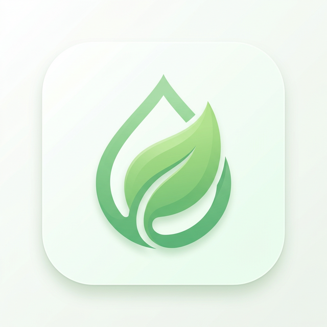

# 🌿 SkinCalm – Eczema Management System

**SkinCalm** is a specialized Progressive Web App (PWA) developed to address the challenges of tracking chronic skin conditions. I built this tool to provide a structured, privacy-first way to monitor flare-ups, manage steroid cream tapering, and identify environmental triggers.

## 🩺 The Problem & Solution
Managing dyshidrotic eczema or similar conditions often requires meticulous tracking of medication, symptoms, and lifestyle factors. Traditional apps are often too generic or lack offline privacy. **SkinCalm** was created as a purpose-built solution to bridge this gap, offering a focused interface for daily logging and long-term trend analysis.

## ✨ Key Features
- **Medication Management**: Log steroid cream application with integrated tapering phase tracking (Daily to Stopped).
- **Symptom Intelligence**: Monitor specific indicators like fluid blisters, inflammation, and itch intensity (0-10 scale).
- **Trigger Analysis**: Correlate skin health with weather, stress levels, diet, and lifestyle habits (e.g., wet hands, glove use).
- **Visual Progress**: Staged photo uploads for objective healing assessment.
- **Privacy-First Architecture**: All data is stored locally via `localStorage`. No external accounts or servers required.
- **PWA Experience**: Fully responsive and installable to iOS/Android home screens for offline-first access.

## 🚀 Deployment
This is a static PWA and can be hosted effortlessly on services like **Vercel** or **GitHub Pages**.

### GitHub Pages Setup:
1. Enable **Pages** in repo settings.
2. Select the `main` branch and the `/root` folder.
3. Your management system will be live at `https://[username].github.io/skin-tracker-app/`.

## 🛠️ Tech Stack
- **Frontend**: Vanilla HTML5, CSS3, JavaScript (ES6+).
- **Offline**: Service Workers & Web App Manifest.
- **Iconography**: Custom-generated AI assets.

---
*Created as a personal utility for better skin health management.*
